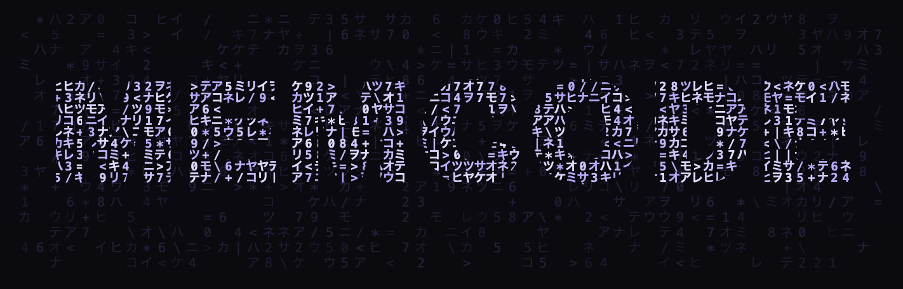
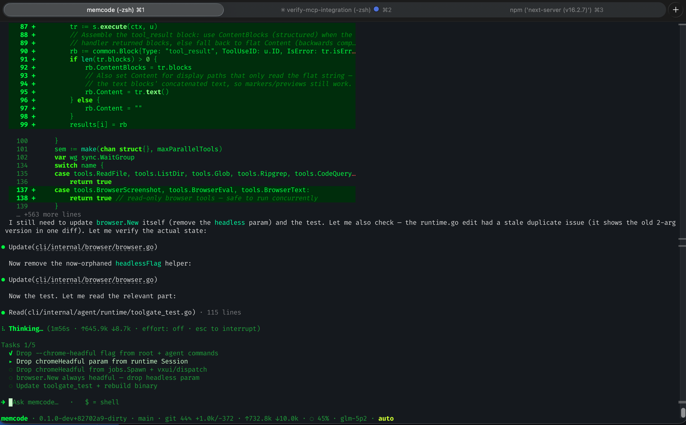
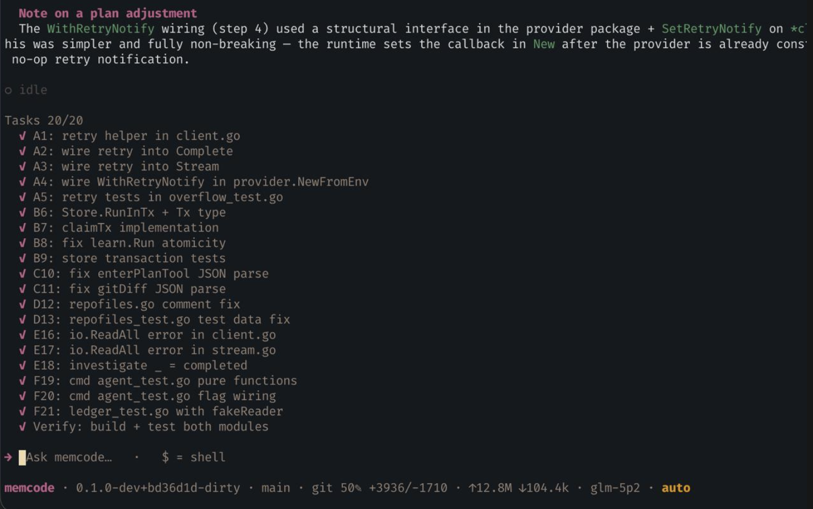

<p align="center">
  
</p>

<p align="center"><b>The coding agent that remembers your repo.</b></p>

<p align="center">
  <a href="https://memcode.ai"></a>
  <a href="https://github.com/memcode-ai/memcode/releases"></a>
  <a href="LICENSE"></a>
</p>

Most coding agents start every session from zero. memcode keeps a persistent model of your repo in `.memcode`: the subsystems, what you worked on last week, which approaches failed and why, and the preferences you have corrected it on. The longer you use it, the less you have to explain.

One Go binary, a full terminal UI, and it runs against whatever models you already have: the hosted memcode gateway, your own API keys, or a local endpoint like Ollama.

<p align="center">
  
</p>

<p align="center">
  
</p>

<table>
<tr><td><b>Remembers your repo</b></td><td>Version-control-friendly state in <code>.memcode</code> that survives sessions and machines. Searchable session history. Repeated failures distill into lessons that resurface when they matter. Honors <code>MEMCODE.md</code>, <code>AGENTS.md</code>, and <code>CLAUDE.md</code> instructions, and compresses oversized ones once instead of re-reading them forever.</td></tr>
<tr><td><b>Model policy in the client</b></td><td>Automatic mode routes each call by what the turn needs: cheap models for routine work, strong models for planning, review, high-risk changes, and recovery after its own mistakes. Pin any model with <code>/model</code>. Failures walk catalog-defined fallback chains. See <a href="ROUTING.md">ROUTING.md</a>.</td></tr>
<tr><td><b>Bring your own models</b></td><td>Works with no account: point it at any OpenAI-compatible endpoint. Provider-native APIs get full fidelity, the Responses API on api.openai.com, Messages on api.anthropic.com, Gemini and xAI likewise. Standard key env vars are picked up automatically.</td></tr>
<tr><td><b>Reads the room</b></td><td>Tracks the working mood of the session. When you are correcting it, it stops cutting corners, spends more on the model, and asks before acting. When things are calm it stays out of the way.</td></tr>
<tr><td><b>A real terminal UI</b></td><td>Multiline editing, slash commands with autocomplete, streaming tool output, interrupt and redirect mid-turn, themes, and a live context meter.</td></tr>
<tr><td><b>Plans before it builds</b></td><td><code>/plan</code> researches with parallel scouts, drafts, gets a cross-model review, and turns the approved plan into a binding contract for execution.</td></tr>
<tr><td><b>Delegates and parallelizes</b></td><td>Spawn read-only explorers or full sub-agents, run detached background jobs, and manage them with <code>/jobs</code>, <code>/tail</code>, <code>/kill</code>.</td></tr>
<tr><td><b>Table stakes, done properly</b></td><td>MCP client, Agent Skills, hooks (<a href="HOOKS.md">HOOKS.md</a>), resident LSP for diagnostics and navigation, a sandboxed shell with a real command classifier, vision and PDF input, prompt caching, and context compaction that respects the model's actual window (<a href="COMPACTION.md">COMPACTION.md</a>).</td></tr>
<tr><td><b>Self-updating</b></td><td>Stages updates in the background and applies them on the next launch. <code>MEMCODE_AUTO_UPDATE=off</code> keeps it manual.</td></tr>
</table>

---

## Quick install

```bash
curl -fsSL https://memcode.ai/install.sh | sh
```

Or with Go:

```bash
go install github.com/memcode-ai/memcode@latest
```

Or build from source:

```bash
git clone https://github.com/memcode-ai/memcode
cd memcode && go build -o memcode .
```

Then run `memcode` in a repo.

## Use any model

```bash
MEMCODE_ENDPOINT_URL=http://localhost:11434/v1 memcode      # Ollama, local
MEMCODE_ENDPOINT_URL=https://api.openai.com/v1 memcode      # your OpenAI key (OPENAI_API_KEY)
MEMCODE_ENDPOINT_URL=https://api.anthropic.com memcode      # your Anthropic key (ANTHROPIC_API_KEY)
```

`OPENAI_API_KEY`, `ANTHROPIC_API_KEY`, `GEMINI_API_KEY`, `XAI_API_KEY`, `FIREWORKS_API_KEY`, and friends are picked up automatically for their hosts. Named endpoints live in config, and `/model` switches models mid-session.

With a memcode account you get one balance across every vendor, a key vault for BYOK, and hosted web search:

```bash
memcode login
```

## Self-hosting

The whole product is in this repo, gateway included, and the gateway is a single stateless binary:

```bash
cd deploy/docker && cp ../../.example.env .env   # set a token + a provider key
docker compose up --build
```

See [docs/self-hosting.md](docs/self-hosting.md). The hosted service at [memcode.ai](https://memcode.ai) runs this same code with a private control plane on top (accounts, one balance across vendors, the BYOK vault, team features).

## Architecture

The CLI is the agent: all model selection, escalation, and recovery run client-side; every backend is a plain serving surface speaking one OpenAI-compatible wire ([protocol/PROTOCOL.md](protocol/PROTOCOL.md)). The gateway under `gateway/` is that serving surface, metered and typed, sharing one provider implementation with the CLI. Cloud-only behavior sits behind one control-plane seam; self-host mode constructs none of it.

## License

MIT. See [LICENSE](LICENSE).
