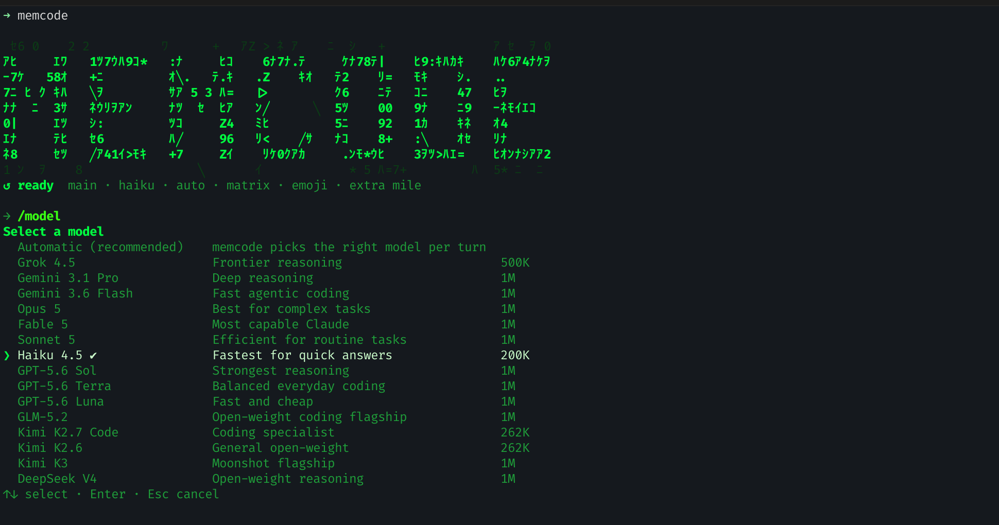

<p align="center">
  
</p>

<p align="center"><b>The coding agent that remembers your repo.</b></p>

<p align="center">
  <a href="https://memcode.ai"></a>
  <a href="https://github.com/memcode-ai/memcode/releases"></a>
  <a href="LICENSE"></a>
</p>

## Memcode

Most coding agents start every session from zero. memcode keeps a persistent model of your repo in `.memcode`: the subsystems, what you worked on last week, which approaches failed and why, and the preferences you have corrected it on. The longer you use it, the less you have to explain.

One Go binary, two ways to run it. **Code** is the interactive agent in your terminal. **Agents** is the same binary as a self-hosted gateway, answering on the chat surfaces you already use — and running agents you have given a standing objective and permission to work on it unattended. Both run against whatever models you have: your own API keys, a local endpoint like Ollama, or a hosted memcode account.

## Screenshots

<p align="center">
  
</p>

<p align="center">
  
</p>

## Code

Run `memcode` in a repo and you get a full terminal coding agent.

**It remembers.** Ask it to pick up where you left off last week and it can. It knows your repo's layout, what has been tried before, and the preferences you have corrected it on. Memory lives in `.memcode`, so it travels with the repo and your whole team benefits.

**Pick a model or let it decide.** Out of the box it uses cheap models for routine work and strong models when the task is hard or risky. Pin any model with `/model` when you want control.

**Reads the room.** When you are correcting it, it slows down, asks before acting, and stops cutting corners. When things are calm it stays out of your way.

**Plan first when it matters.** `/plan` researches your codebase, drafts an approach, and gets a second model's review before you approve it. Execution then sticks to what you approved.

**Work in parallel.** Hand off side quests to sub-agents and background jobs, keep working, and check on them with `/jobs` and `/tail`.

**A terminal UI that keeps up.** Multiline editing, slash-command autocomplete, streaming output, interrupt and redirect mid-turn, themes, and a live context meter.

**Everything you'd expect.** MCP servers, Agent Skills, hooks, code navigation and diagnostics, vision and PDF input, instructions from `MEMCODE.md`, `AGENTS.md`, or `CLAUDE.md`, and automatic updates.

## Agents

Message your agent from wherever you already are. It runs your task and replies in the same conversation. Fix a bug from Telegram on the train, ask for a status update over SMS, forward an email and get it handled.

**Twelve channels.** Telegram, Discord, Slack, GitHub, WhatsApp, Email, Signal, Matrix, Mattermost, Microsoft Teams, Google Chat, and SMS. `memcode gateway setup` walks you through connecting each one.

**Voice.** Send a voice note instead of typing. Replies can come back as voice too, per channel and off by default.

**You decide who gets in.** Unknown senders have to pair first: they get a code, you approve it. Allow-lists per channel on top of that.

**Coming from Hermes or OpenClaw?** `memcode hermes migrate` or `memcode claw migrate` brings over your channels, API keys, skills, and long-term memory in one command.

## Agents that run on their own

An agent can be given a durable **objective** and permission to run
**autonomously** — then it works on that objective on a schedule, with nobody
watching. It is the same agent either way; autonomy is a setting, not a
separate kind. You set it up by talking to `memcode admin`.

Objective and autonomy are separate grants on purpose: an agent may hold a goal
you only ever work on together, and an agent may run unattended on a schedule
with no standing objective at all. The second case is why this matters — an
unattended run is policy-gated (authority approved in advance, by hash),
journals every consequential action, confines file access to explicit grants,
and can suspend durably to ask you something rather than guessing. Plain
scheduled agents never had any of that.

It can also delegate real work to a scoped worker with browser, MCP, shell and
filesystem access, and drive your own signed-in Chrome rather than a
logged-out profile. See `docs/autonomous-agents.md`.

## Install

```bash
curl -fsSL https://memcode.ai/install.sh | sh
```

Or with Go:

```bash
go install github.com/memcode-ai/memcode@latest
```

Or build from source:

```bash
git clone https://github.com/memcode-ai/memcode
cd memcode && go build -o memcode .
```

Then run `memcode` in a repo.

## Use any model

```bash
MEMCODE_ENDPOINT_URL=http://localhost:11434/v1 memcode      # Ollama, local
MEMCODE_ENDPOINT_URL=https://api.openai.com/v1 memcode      # your OpenAI key (OPENAI_API_KEY)
MEMCODE_ENDPOINT_URL=https://api.anthropic.com memcode      # your Anthropic key (ANTHROPIC_API_KEY)
```

Your provider API keys are picked up automatically from the standard environment variables.

With a memcode account you get one balance across every vendor, a key vault for BYOK, and hosted web search:

```bash
memcode login
```

## Documentation

The user manual lives at [memcode.ai/docs](https://memcode.ai/docs):

- [Code](https://memcode.ai/docs): commands, model routing, memory, plan mode, MCP, skills, custom instructions, configuration.
- [Agents](https://memcode.ai/docs/agents): per-channel setup guides for every gateway channel, pairing, and voice.

Internals and reference docs live in this repo:

- [ROUTING.md](ROUTING.md): how Automatic mode picks models.
- [HOOKS.md](HOOKS.md): the hook surface.
- [COMPACTION.md](COMPACTION.md): context compaction.
- [docs/gateway/README.md](docs/gateway/README.md): gateway operations and channel secrets.
- [protocol/PROTOCOL.md](protocol/PROTOCOL.md): the wire protocol every backend speaks.

## Architecture

The CLI is the agent: all model selection, escalation, and recovery run client-side; every backend is a plain serving surface speaking one OpenAI-compatible wire. Point memcode at your own API keys, a local endpoint like Ollama, or a hosted [memcode.ai](https://memcode.ai) account.

## License

MIT. See [LICENSE](LICENSE).
